# Accredian Enterprise Clone — Step-by-Step Development Plan

## Project Overview

| Item | Detail |
|---|---|
| **Goal** | Partial clone of [enterprise.accredian.com](https://enterprise.accredian.com/) |
| **Framework** | Next.js 14+ (App Router) |
| **Styling** | Tailwind CSS |
| **Language** | JavaScript (functional components + hooks) |
| **Deployment** | Vercel |
| **Bonus** | Lead capture form + API routes |

---

## Architecture & Project Structure

```
accredian-enterprise/
├── app/
│   ├── layout.js              # Root layout (fonts, metadata, global styles)
│   ├── page.js                # Home page (composes all sections)
│   ├── globals.css            # Tailwind directives + custom animations
│   └── api/
│       └── leads/
│           └── route.js       # POST endpoint for lead capture (Bonus)
├── components/
│   ├── layout/
│   │   ├── Navbar.jsx         # Sticky navigation
│   │   └── Footer.jsx         # Site footer
│   ├── sections/
│   │   ├── Hero.jsx           # Hero banner
│   │   ├── TrustedBy.jsx      # Partner logos marquee
│   │   ├── Stats.jsx          # Track record / impact numbers
│   │   ├── Programs.jsx       # Enterprise programs/offerings
│   │   ├── WhyAccredian.jsx   # Why choose us / features
│   │   ├── HowItWorks.jsx     # Step-by-step process
│   │   ├── CaseStudies.jsx    # Success stories / impact
│   │   ├── Testimonials.jsx   # Client reviews carousel
│   │   ├── FAQ.jsx            # Accordion FAQ
│   │   └── CTA.jsx            # Final call-to-action
│   └── ui/
│       ├── Button.jsx         # Reusable button component
│       ├── SectionHeading.jsx  # Reusable section title + subtitle
│       ├── Card.jsx           # Reusable card component
│       ├── AccordionItem.jsx  # Single FAQ accordion item
│       ├── LeadForm.jsx       # Lead capture modal/form (Bonus)
│       └── StatCard.jsx       # Individual stat display
├── data/
│   ├── programs.js            # Programs mock data
│   ├── testimonials.js        # Testimonials mock data
│   ├── faq.js                 # FAQ mock data
│   ├── stats.js               # Stats mock data
│   └── partners.js            # Partner logos data
├── hooks/
│   └── useIntersectionObserver.js  # Scroll-triggered animations
├── public/
│   ├── images/                # All static images/logos
│   └── favicon.ico
├── tailwind.config.js
├── next.config.js
└── package.json
```

### Key Architecture Decisions

| Decision | Rationale |
|---|---|
| **App Router** | Assignment prefers it; gives us server components, API routes, and modern Next.js patterns |
| **Mock data in `/data` files** | Clean separation of content from UI; easy to swap with real API later |
| **Reusable `/ui` components** | `Button`, `Card`, `SectionHeading` etc. are used across multiple sections — demonstrates component reusability |
| **Custom hook** | `useIntersectionObserver` for scroll animations shows React hooks proficiency |
| **API route for leads** | Demonstrates full-stack capability with Next.js API routes |

---

## Development Steps

---

### Step 1: Project Setup & Foundation
**Estimated scope: ~15% of work**

#### What gets built:
- Initialize Next.js project with App Router
- Configure Tailwind CSS with custom theme (colors matching Accredian's brand blue, grays)
- Set up Google Font (Poppins) in `layout.js`
- Create root layout with metadata (SEO title, description, viewport)
- Create the reusable UI primitives: `Button.jsx`, `SectionHeading.jsx`, `Card.jsx`
- Set up `globals.css` with Tailwind directives + custom CSS variables + animation keyframes

#### Deliverable:
✅ Running Next.js app with Tailwind, fonts loaded, reusable UI components ready

#### Files created:
- `app/layout.js`, `app/page.js`, `app/globals.css`
- `components/ui/Button.jsx`
- `components/ui/SectionHeading.jsx`
- `components/ui/Card.jsx`
- `tailwind.config.js` (custom theme)

---

### Step 2: Navigation + Hero + Trusted By (Above the Fold)
**Estimated scope: ~20% of work**

#### What gets built:
- **Navbar** — Sticky top navigation with logo, menu links (Programs, Stats, Testimonials, FAQ), and CTA button. Mobile hamburger menu with slide-in drawer
- **Hero Section** — Full-width hero with headline, subheadline, CTA buttons, and a hero image/illustration. Background gradient or pattern
- **TrustedBy Section** — Infinite-scroll marquee of partner company logos (CSS animation, no library)

#### Deliverable:
✅ Complete above-the-fold experience — user lands and sees nav, hero, and partner logos

#### Files created:
- `components/layout/Navbar.jsx`
- `components/sections/Hero.jsx`
- `components/sections/TrustedBy.jsx`
- `data/partners.js`

#### Key implementation details:
- Navbar uses `useState` for mobile menu toggle
- Smooth scroll to sections via `href="#sectionId"`
- Marquee built with CSS `@keyframes` + duplicated logo list (no JS library)
- Hero is responsive: stacked on mobile, side-by-side on desktop

---

### Step 3: Stats + Programs + Why Accredian (Core Value Sections)
**Estimated scope: ~25% of work**

#### What gets built:
- **Stats Section** — "Our Track Record" with 3 key metrics in cards. Animated counters that trigger on scroll using `useIntersectionObserver`
- **Programs Section** — Grid/cards showing enterprise training programs with icons, titles, descriptions. Interactive hover effects
- **WhyAccredian Section** — Feature cards or icon+text grid explaining key differentiators
- **StatCard.jsx** reusable component with animated counter

#### Deliverable:
✅ All value proposition sections live — stats, programs, features

#### Files created:
- `components/sections/Stats.jsx`
- `components/sections/Programs.jsx`
- `components/sections/WhyAccredian.jsx`
- `components/ui/StatCard.jsx`
- `hooks/useIntersectionObserver.js`
- `data/programs.js`
- `data/stats.js`

#### Key implementation details:
- `useIntersectionObserver` custom hook wraps `IntersectionObserver` API
- Stat counters animate from 0 → target value using `useEffect` + `requestAnimationFrame`
- Programs data is mapped from `data/programs.js` — demonstrates data-driven rendering
- Cards use the reusable `Card.jsx` component with different content

---

### Step 4: How It Works + Case Studies + Testimonials (Social Proof)
**Estimated scope: ~20% of work**

#### What gets built:
- **HowItWorks Section** — Step-by-step process (3-4 steps) with numbered cards or a visual timeline
- **CaseStudies Section** — Success story cards with company names, results, metrics
- **Testimonials Section** — Carousel/slider of client testimonials with quote, name, designation, company logo. Built with custom CSS scroll-snap (no Swiper dependency)

#### Deliverable:
✅ All social proof and process sections complete

#### Files created:
- `components/sections/HowItWorks.jsx`
- `components/sections/CaseStudies.jsx`
- `components/sections/Testimonials.jsx`
- `data/testimonials.js`

#### Key implementation details:
- Testimonials use CSS `scroll-snap-type` for carousel behavior — lightweight, no library
- Navigation dots built manually with `useState` tracking active index
- HowItWorks uses a responsive layout: vertical steps on mobile, horizontal on desktop
- All data is sourced from mock data files

---

### Step 5: FAQ + CTA + Footer + Lead Form (Completion & Bonus)
**Estimated scope: ~15% of work**

#### What gets built:
- **FAQ Section** — Categorized accordion with tab-based category switching. Custom `AccordionItem` component with smooth height animation
- **CTA Section** — Bold call-to-action with gradient background and "Enquire Now" button that opens lead form modal
- **Footer** — Multi-column footer with logo, links, social icons, copyright
- **Lead Capture Form (Bonus)** — Modal form with fields: Name, Email, Phone, Company, Message. Form validation. Submits to Next.js API route
- **API Route (Bonus)** — `POST /api/leads` endpoint that receives form data, validates, and stores (in-memory or JSON file for demo)

#### Deliverable:
✅ Full page complete with all sections, lead form working end-to-end

#### Files created:
- `components/sections/FAQ.jsx`
- `components/sections/CTA.jsx`
- `components/layout/Footer.jsx`
- `components/ui/AccordionItem.jsx`
- `components/ui/LeadForm.jsx`
- `app/api/leads/route.js`
- `data/faq.js`

#### Key implementation details:
- FAQ accordion uses `useState` for active item, CSS `max-height` transition for smooth open/close
- Lead form uses `useState` for form state, basic validation (required fields, email regex)
- API route returns JSON response with success/error status
- Modal uses portal pattern or simple overlay with `fixed` positioning

---

### Step 6: Polish, Responsiveness, Deployment & Documentation
**Estimated scope: ~5% of work**

#### What gets done:
- **Responsive audit** — Test and fix all breakpoints (375px, 768px, 1024px, 1440px)
- **Animations** — Add subtle fade-in/slide-up animations on scroll for all sections using the custom hook
- **Performance** — Optimize images (use `next/image`), ensure lazy loading, check Lighthouse score
- **SEO** — Proper metadata in `layout.js`, semantic HTML (h1 → h6 hierarchy, landmark elements)
- **Deployment** — Push to GitHub, deploy on Vercel
- **Documentation** — Add README.md documenting:
  - Setup instructions
  - Tech choices and reasoning
  - Where AI helped (analysis, component planning, content generation)
  - Improvements beyond the original

#### Deliverable:
✅ Production-ready, deployed on Vercel, with documentation

#### Files created/updated:
- `README.md`
- Various component fixes for responsiveness

---

## AI Usage Documentation

> This will be included in the final README.md

| Area | How AI Helped |
|---|---|
| **Website Analysis** | AI analyzed the production CSS/JS bundles of enterprise.accredian.com to reverse-engineer the section structure, tech stack, and design patterns |
| **Architecture Planning** | AI designed the component hierarchy, file structure, and data separation strategy |
| **Mock Data Generation** | AI will generate realistic mock data for programs, testimonials, FAQ, and stats |
| **Component Code** | AI will assist in writing component code following React best practices |
| **Styling** | AI will help with Tailwind utility classes and custom CSS animations |
| **Debugging** | AI will help troubleshoot responsive layout issues and animation timing |

---

## Summary Timeline

```mermaid
gantt
    title Development Steps
    dateFormat X
    axisFormat %s
    
    section Foundation
    Step 1 - Setup & UI Primitives    :s1, 0, 15
    
    section Above the Fold
    Step 2 - Nav + Hero + Partners    :s2, 15, 35
    
    section Core Content
    Step 3 - Stats + Programs + Features :s3, 35, 60
    
    section Social Proof
    Step 4 - Process + Testimonials   :s4, 60, 80
    
    section Completion
    Step 5 - FAQ + Footer + Lead Form :s5, 80, 95
    
    section Deployment
    Step 6 - Polish + Deploy          :s6, 95, 100
```



> [!TIP]
> Each step builds on the previous one. The page will be progressively functional — after Step 2 you'll already have a presentable landing page, and each subsequent step adds more sections.

> [!NOTE]
> **Shall I begin with Step 1?** Once you approve this plan, I'll start scaffolding the Next.js project and building the foundation.
