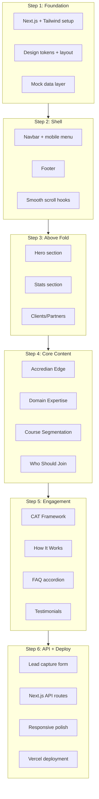

# Accredian Enterprise Page — 6-Step Development Plan

## Reference Analysis

The live site at [enterprise.accredian.com](https://enterprise.accredian.com/) is a **single-page landing experience** with anchor-based navigation. Confirmed sections (top to bottom):

| # | Section ID | Content |
|---|-----------|---------|
| 1 | `#home` | Hero — "Next-Gen Expertise for Your Enterprise" + 4 value bullets + Enquire CTA |
| 2 | `#stats` | Track Record — animated stat cards (10K+, 200+, 5K+) |
| 3 | `#clients` | Proven Partnerships — client/partner logo strip |
| 4 | `#edge` | Accredian Edge — 4 strategic training pillars |
| 5 | — | Domain Expertise — 7 domain cards (Product, Gen-AI, Leadership, Tech & Data, etc.) |
| 6 | — | Tailored Course Segmentation — 5 filter categories |
| 7 | — | Who Should Join — 4 audience personas (Tech, Non-Tech, Emerging, Senior) |
| 8 | `#cat` | CAT Framework — learning methodology overview |
| 9 | `#how-it-works` | 3-step delivery process (Skill Gap → Training Plan → Delivery) |
| 10 | `#faqs` | FAQ accordion grouped by About Course / Delivery / Miscellaneous |
| 11 | `#testimonials` | Partner testimonial carousel |
| 12 | — | Contact CTA — "Want to Learn More..." + lead form area |
| 13 | Footer | Links, email, address, copyright |

Nav links: **Home, Stats, Clients, Accredian Edge, CAT, How It Works, FAQs, Testimonials** + sticky **Enquire Now** button.



---

## Tech Stack Decisions

- **Framework:** Next.js 15+ (App Router), TypeScript
- **Styling:** Tailwind CSS v4 — fast iteration, responsive utilities, consistent spacing
- **State/Hooks:** `useState`, `useEffect`, custom `useScrollSpy` for active nav highlighting
- **Data:** Centralized mock JSON in [`lib/data/enterprise.ts`](lib/data/enterprise.ts), served via `GET /api/enterprise-data`
- **Forms:** Client-side validation + `POST /api/leads` (in-memory store for demo)
- **Deploy:** Vercel (zero-config for Next.js)

---

## Proposed Folder Structure

```
accredian-enterprise/
├── app/
│   ├── layout.tsx              # Root layout, fonts, metadata
│   ├── page.tsx                # Landing page (composes all sections)
│   ├── globals.css             # Tailwind imports + CSS variables
│   └── api/
│       ├── enterprise-data/route.ts   # GET — page content
│       └── leads/route.ts             # POST — lead capture (bonus)
├── components/
│   ├── layout/
│   │   ├── Navbar.tsx
│   │   └── Footer.tsx
│   ├── sections/
│   │   ├── Hero.tsx
│   │   ├── Stats.tsx
│   │   ├── Clients.tsx
│   │   ├── AccredianEdge.tsx
│   │   ├── DomainExpertise.tsx
│   │   ├── CourseSegmentation.tsx
│   │   ├── WhoShouldJoin.tsx
│   │   ├── CATFramework.tsx
│   │   ├── HowItWorks.tsx
│   │   ├── FAQ.tsx
│   │   ├── Testimonials.tsx
│   │   └── ContactCTA.tsx
│   ├── ui/
│   │   ├── Button.tsx
│   │   ├── SectionHeading.tsx
│   │   ├── Card.tsx
│   │   ├── Accordion.tsx
│   │   └── LeadForm.tsx
│   └── shared/
│       └── Container.tsx
├── hooks/
│   ├── useScrollSpy.ts
│   └── useMediaQuery.ts
├── lib/
│   ├── data/enterprise.ts      # Static mock content
│   └── types/index.ts          # Shared TypeScript interfaces
└── public/
    └── images/                 # Logos, placeholders
```

---

## Step-by-Step Development Process

### Step 1 — Project Foundation & Data Layer
**Goal:** Bootstrapped, runnable Next.js project with design system and content architecture.

**Tasks:**
- Run `npx create-next-app@latest accredian-enterprise --typescript --tailwind --eslint --app --src-dir=false`
- Configure [`app/globals.css`](app/globals.css) with CSS variables: primary brand color (blue/teal from reference), neutral grays, section spacing scale
- Set up [`app/layout.tsx`](app/layout.tsx) with metadata (`title`, `description`), Google Font (Inter or similar clean sans-serif)
- Define TypeScript interfaces in [`lib/types/index.ts`](lib/types/index.ts): `NavLink`, `StatItem`, `DomainCard`, `FAQItem`, `Testimonial`, `LeadPayload`
- Create [`lib/data/enterprise.ts`](lib/data/enterprise.ts) with all section content extracted from the reference site (headings, descriptions, stats, FAQ answers, testimonials)
- Build reusable UI primitives: `Container`, `SectionHeading`, `Button`, `Card`
- Create empty [`app/page.tsx`](app/page.tsx) that imports section placeholders

**Deliverable:** App runs on `localhost:3000` with design tokens and typed mock data ready.

---

### Step 2 — Navigation Shell & Footer
**Goal:** Sticky header with smooth section scrolling and responsive mobile menu; complete footer.

**Tasks:**
- Build [`components/layout/Navbar.tsx`](components/layout/Navbar.tsx):
  - Desktop: logo + anchor links + "Enquire Now" CTA
  - Mobile: hamburger toggle → slide-down or drawer menu
  - Sticky behavior with background blur/shadow on scroll
- Implement [`hooks/useScrollSpy.ts`](hooks/useScrollSpy.ts) to highlight active nav item based on viewport section
- Add `scroll-behavior: smooth` in globals + `id` attributes on each section wrapper
- Build [`components/layout/Footer.tsx`](components/layout/Footer.tsx):
  - Company links (About, Blog, Why Accredian)
  - Contact block (email, Gurugram address)
  - Copyright line
- Wire Navbar + Footer into [`app/layout.tsx`](app/layout.tsx) or [`app/page.tsx`](app/page.tsx)

**Deliverable:** Fully functional nav/footer; clicking nav items scrolls to correct sections on desktop and mobile.

---

### Step 3 — Hero, Stats & Clients (Above-the-Fold)
**Goal:** Complete the top three sections that establish credibility immediately.

**Tasks:**
- **Hero** ([`components/sections/Hero.tsx`](components/sections/Hero.tsx)):
  - H1, subtitle, 4 bullet value props (Tailored Solutions, Industry Insights, etc.)
  - Primary CTA button linking to contact section
  - Responsive two-column layout (text left, visual/illustration placeholder right)
- **Stats** ([`components/sections/Stats.tsx`](components/sections/Stats.tsx)):
  - Section heading "Our Track Record"
  - 3 stat cards in a responsive grid
  - Optional: simple count-up animation on scroll-into-view (`useEffect` + Intersection Observer)
- **Clients** ([`components/sections/Clients.tsx`](components/sections/Clients.tsx)):
  - Partner logo grid or horizontal scroll strip
  - Use placeholder logos or grayscale brand names initially

**Deliverable:** Polished above-fold experience, responsive from 320px to desktop.

---

### Step 4 — Core Content Sections (Middle of Page)
**Goal:** Build the four dense content blocks that explain Accredian's offering.

**Tasks:**
- **Accredian Edge** ([`components/sections/AccredianEdge.tsx`](components/sections/AccredianEdge.tsx)):
  - 4 pillar cards with icons (Measurable Impact, Expert Guidance, etc.)
  - `id="edge"` for nav anchor
- **Domain Expertise** ([`components/sections/DomainExpertise.tsx`](components/sections/DomainExpertise.tsx)):
  - 7 domain cards in responsive grid (2-col tablet, 3-col desktop)
  - Hover lift effect on cards
- **Course Segmentation** ([`components/sections/CourseSegmentation.tsx`](components/sections/CourseSegmentation.tsx)):
  - 5 segmentation blocks (Program, Industry, Topic, Level, Who Should Join header)
  - Tag/chip style for sub-items
- **Who Should Join** ([`components/sections/WhoShouldJoin.tsx`](components/sections/WhoShouldJoin.tsx)):
  - 4 persona cards (Tech, Non-Tech, Emerging, Senior Professionals)
  - Alternating or grid layout

**Deliverable:** All middle content sections rendering from mock data, grid layouts collapsing cleanly on mobile.

---

### Step 5 — Engagement Sections (Process, FAQ, Social Proof)
**Goal:** Interactive and trust-building sections at the bottom of the page.

**Tasks:**
- **CAT Framework** ([`components/sections/CATFramework.tsx`](components/sections/CATFramework.tsx)):
  - Visual framework diagram or numbered steps
  - `id="cat"` anchor
- **How It Works** ([`components/sections/HowItWorks.tsx`](components/sections/HowItWorks.tsx)):
  - 3-step horizontal timeline (desktop) → vertical stack (mobile)
  - Numbered steps: Skill Gap Analysis → Customized Training Plan → Flexible Program Delivery
  - `id="how-it-works"` anchor
- **FAQ** ([`components/sections/FAQ.tsx`](components/sections/FAQ.tsx)):
  - Reusable [`components/ui/Accordion.tsx`](components/ui/Accordion.tsx) component
  - Group headings: About the Course, About the Delivery, Miscellaneous
  - Expand/collapse with `useState`; only one open at a time (optional)
  - `id="faqs"` anchor
- **Testimonials** ([`components/sections/Testimonials.tsx`](components/sections/Testimonials.tsx)):
  - Carousel with prev/next buttons or dot indicators
  - 3 client quotes from reference site
  - `id="testimonials"` anchor

**Deliverable:** All remaining content sections complete with working accordion and testimonial navigation.

---

### Step 6 — API Integration, Lead Form, Polish & Deployment
**Goal:** Meet all mandatory + bonus requirements; ship to Vercel.

**Tasks:**
- **API Routes:**
  - `GET /api/enterprise-data` — returns [`lib/data/enterprise.ts`](lib/data/enterprise.ts) as JSON; refactor sections to optionally fetch from this endpoint (demonstrates API integration)
  - `POST /api/leads` — accepts `{ name, email, company, message }`, validates server-side, stores in in-memory array, returns `{ success, id }`
- **Lead Capture Form** ([`components/ui/LeadForm.tsx`](components/ui/LeadForm.tsx) + [`components/sections/ContactCTA.tsx`](components/sections/ContactCTA.tsx)):
  - Fields: name, email, company, optional message
  - Client validation (required fields, email format)
  - Submit → POST to `/api/leads` → success/error toast or inline message
  - "Enquire Now" buttons throughout page scroll to this section
- **Responsive Polish Pass:**
  - Test breakpoints: 320px, 768px, 1024px, 1440px
  - Fix overflow, touch targets (min 44px), readable font sizes
  - Add subtle hover/focus states for accessibility
- **Documentation:**
  - Create [`README.md`](README.md) with: project overview, tech stack, local setup, API docs, deployment steps, and **"Where AI Helped"** section (see below)
- **Deploy to Vercel:**
  - Push to GitHub → connect repo on vercel.com → auto-deploy
  - Verify live URL works (API routes + form submission)

**Deliverable:** Production-ready deployed site with working lead form and documented AI usage.

---

## Reusable Component Strategy

| Component | Reused By |
|-----------|-----------|
| `Container` | Every section — consistent max-width + padding |
| `SectionHeading` | Every section — title + subtitle pattern |
| `Card` | Edge, Domain, Segmentation, Audience, HowItWorks |
| `Button` | Hero CTA, Navbar, ContactCTA, LeadForm |
| `Accordion` | FAQ section |
| `useScrollSpy` | Navbar active state |

---

## API Design (Mock)

```typescript
// GET /api/enterprise-data
{ navLinks, hero, stats, clients, edge, domains, segmentation, audience, cat, howItWorks, faqs, testimonials, contact, footer }

// POST /api/leads
// Request:  { name: string, email: string, company: string, message?: string }
// Response: { success: true, id: string } | { success: false, error: string }
```

---

## Where AI Helped (for Submission README)

Document these honestly in the README:

1. **Site structure analysis** — AI browser inspection mapped all sections, nav links, and content hierarchy from the live reference
2. **Component architecture** — AI suggested folder structure and reusable component breakdown
3. **Mock data authoring** — AI helped extract and structure content (headings, stats, FAQ text) from the reference site
4. **Boilerplate generation** — AI accelerated Next.js setup, TypeScript interfaces, and Tailwind config
5. **Responsive patterns** — AI suggested grid breakpoints and mobile nav patterns
6. **Manual work you should own** — Visual styling decisions, copy tweaks, testing on real devices, deployment configuration, and code review/refinement

---

## Evaluation Alignment

| Criterion | How This Plan Addresses It |
|-----------|---------------------------|
| Execution & UI quality | Step 6 dedicated polish pass; structured sections mirroring reference |
| Code structure | Clear separation: `layout/`, `sections/`, `ui/`, `hooks/`, `lib/` |
| Component reusability | Shared primitives (`Card`, `Button`, `Accordion`, `Container`) |
| Thought process | Data-first approach (Step 1), shell-first (Step 2), top-to-bottom content build |
| AI tool usage | Documented transparently in README |
| Bonus (lead form + API) | Built in Step 6 with validation and mock storage |

---

## Estimated Timeline

| Step | Focus | Est. Time |
|------|-------|-----------|
| 1 | Foundation + data | 1–2 hrs |
| 2 | Nav + footer | 2–3 hrs |
| 3 | Hero + stats + clients | 2–3 hrs |
| 4 | Core content sections | 3–4 hrs |
| 5 | FAQ + testimonials + process | 3–4 hrs |
| 6 | API + form + deploy | 2–3 hrs |
| **Total** | | **~14–19 hrs** |
